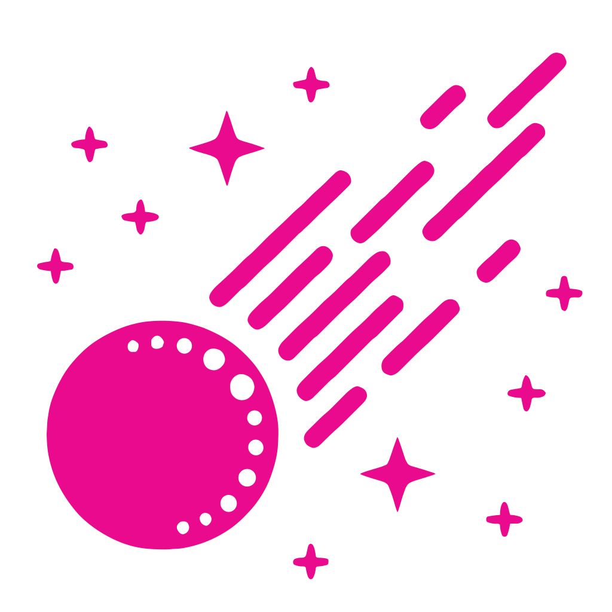

<h1>Comet</h1>

<p align="center">
  Horizon component for the delivery and redelivery of eventMessages with deliveryType callback.
</p>

<p align="center">
  <a href="#prerequisites">Prerequisites</a> •
  <a href="#configuration">Configuration</a> •
  <a href="#running-comet">Running Comet</a>
</p>

## Overview
The Horizon component, which controls the delivery and redelivery of event messages via callback mechanisms, plays a central role in the process of efficient event processing.
We welcome and appreciate contributions from the developer community. Check our [contributing guide](LINK_TO_CONTRIBUTING_GUIDE.md) to get started!

### Prerequisites
To test changes locally, ensure the following prerequisites are met:

- Have a Kubernetes config at `${user.home}/.kube/config.laptop-awsd-live-system` pointing to a non-production cluster.
- Having a namespace as configured in `kubernetes.informer.namespace` and a CustomResource `subscriptions.subscriber.horizon.telekom.de`.
- The resource definition can be found in the [Horizon Essentials Helm Chart](https://gitlab.devops.telekom.de/dhei/teams/pandora/argocd-charts/horizon-3.0/essentials/-/tree/main?ref_type=heads)

## Configuration
Comet configuration is managed through environment variables.

## Running Comet
Follow these steps to set up Horizon Comet for local development. Check the [complete list](docs/environment-variables.md) of supported environment variables for setup instruction

### 1. Clone the Repository

```bash
git clone [repository-url]
cd comet
```

#### 2. Install Dependencies
```bash
./gradlew build
```

#### 3. Start docker-compose
```bash
docker-compuse up -d
```

#### 4. Run Locally
```bash
./gradlew bootRun --args='--spring.profiles.active=dev'
```
This command will start Horizon Comet in development mode.

## Related Projects

- [Starlight](https://gitlab.devops.telekom.de/dhei/teams/pandora/products/horizon/starlight)
- [Galaxy](https://gitlab.devops.telekom.de/dhei/teams/pandora/products/horizon/galaxy)
- [Comet](https://gitlab.devops.telekom.de/dhei/teams/pandora/products/horizon/comet) (*you are here*)
- [Pulsar](https://gitlab.devops.telekom.de/dhei/teams/pandora/products/horizon/tasse)
- [Polaris](https://gitlab.devops.telekom.de/dhei/teams/pandora/products/horizon/plunger)
