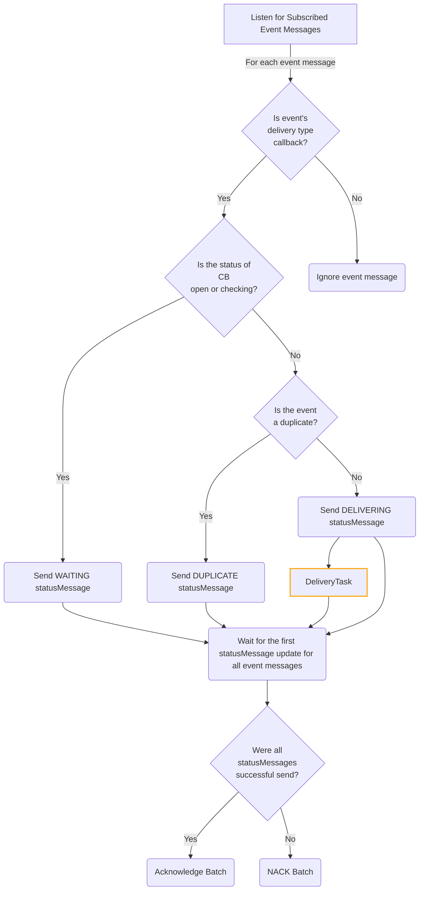
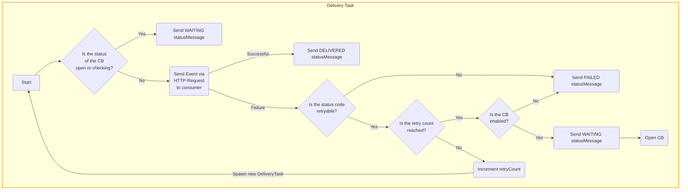

<!--
Copyright 2024 Deutsche Telekom IT GmbH

SPDX-License-Identifier: Apache-2.0
-->

# Architecture
The primary function of the Comet component is to facilitate the delivery of subscription-based event messages to subscribers using a callback for the deliverType.
To achieve this, the component is configured to monitor the Kafka topic labeled as subscribed. The activation of the component is triggered by each newly subscribed event message with a deliverType callback.

Subsequently, the Comet component checks whether the CircuitBreaker has the status open or checking.
The CircuitBreaker acts as a mechanism to halt the delivery of events when the endpoint to receive these events is unreachable.
If the CircuitBreaker is in the open or checking state, the events are not forwarded to the endpoint.
Instead, they are marked as WAITING, the status in Kafka is updated with WAITING and the next event will be processed.

A duplication mechanism is then used to check whether the event has already been handled or processed.
If this is the case, the event is not processed further, its status is set to DUPLICATE and the status in Kafka is updated with DUPLICATE.
Otherwise, the Comet component initiates an attempt to deliver the event, marks it with DELIVERING and updates the status in Kafka with DELIVERING.

Then the deliveryTask starts. As it is possible that the CircuitBreaker for an event opens during the start of the deliveryTask, a new check of the CircuitBreaker status is carried out within the deliveryTask
(whether it is open or being checked). If this is confirmed, the status is set to WAITING again, the status in kafka is updated and the next event is processed.

If the CircuitBreaker is closed, an attempt is made to deliver the event. If a 200, 201, 202 or 204 http statusCode is returned, the event is marked as DELIVERED.
In the case of a 401, 429, 502, 503, or 504 statusCode, repeated attempts are made until the maximum retry counts are reached.

Upon reaching the maximum retry counts, the system checks if the CircuitBreaker is activated for the subscription.
If it is activated, the CircuitBreaker is opened, and the event is marked as WAITING. If the CircuitBreaker is not activated, the event is marked as FAILED.

The event details are then recorded in the deduplication cache with status such as WAITING, FAILED or DELIVERED, and the event status is written in Kafka.

Furthermore, similar to all other components in Horizon, the Comet component incorporates logs, tracing, and metrics to document its functionalities and performance metrics.

### Abbreviations
CB -> CircuitBreaker

## Flowchart

## Delivery Task


## State Diagram
````mermaid
stateDiagram
    PROCESSED --> WAITING: CB is open/checking
    PROCESSED --> DUPLICATE: Event is duplicate
    PROCESSED --> DELIVERING: No open/checking CB

    DELIVERING --> DELIVERED: Successful delivery
    DELIVERING --> FAILED: Internal error<br>or CB is disabled
    DELIVERING --> WAITING: CB is open/checking or<br>retry count is reached
````